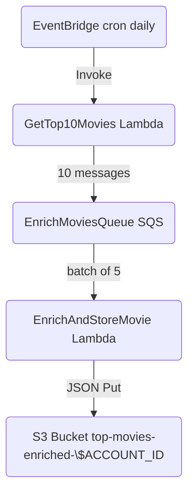

# 🎬 Top-10-Movies Serverless Pipeline

Fetch the **IMDb Top 250**, pick the **10 highest‑rated** titles, enrich each one with
extra metadata from **OMDb**, and drop the results—cleanly versioned JSON
objects—into an S3 bucket.  
All of that happens **serverlessly** on AWS Free Tier, driven by two small
Lambda functions and an SQS queue.

<p align="center">
  
  
  
  
  
  
</p>

---

## ✨ Why you’ll love it

* **One‑click deploy.** A single `./infra/deploy.sh` provisions IAM, SQS, both
  Lambdas and their triggers.
* **Zero‑maintenance.** EventBridge runs the pipeline daily; SQS scales the
  concurrency; IAM keeps the blast‑radius minimal.
* **Readable costs.** Everything fits the AWS Free Tier (< 1 M requests/mo, tiny
  storage).
* **Drop‑in JSONs.** Each object is named `{YYYY-MM-DD}/{rank}_{movie_id}.json` `(2025-07-17/01_tt0111161.json)` — sorted and
  ready for downstream analytics or dashboards.

---

## 🗺️ Architecture (one‑glance)



*GetTop10Movies* never touches S3 permissions—downloads the public
Top 250 JSON directly.

---

## 📁 Repo layout

```text
.
├── lambdas
│   ├── get_top10
│   │   ├── get_top10.py
│   │   └── requirements.txt      # requests
│   └── enrich_and_store
│       ├── enrich_and_store.py
│       └── requirements.txt      # requests
├── infra
│   ├── deploy.sh                 # full IaC‑lite bash deploy
│   └── policy.json               # generated at runtime
└── .env.example                  # copy → .env with your IDs
```

---

## 🚀 Quick start

> Tested on **WSL Ubuntu 22.04** + **AWS CLI v2**.

```bash
# 0. Clone & enter
git clone https://github.com/yourname/top-10-movies-imdb-serverless.git
cd top-10-movies-imdb-serverless

# 1. Fill in .env
cp .env.exmaple .env                # edit ACCOUNT_ID, OMDB_API_KEY …
source .env

# 2. Deploy (≈ 1 min)
cd infra && ./deploy.sh            # creates/upgrades everything

# 3. Trigger once manually
aws lambda invoke   --function-name GetTop10Movies   --payload '{}' /dev/stdout   --region "$AWS_DEFAULT_REGION"

# 4. Watch objects appear
aws s3 ls s3://$ENRICH_BUCKET/ --region "$AWS_DEFAULT_REGION"
```

Daily cron is already scheduled; each run costs < 1¢.

---

## 🔧 Environment variables

| Variable            | Description                                 | Example                                 |
|---------------------|---------------------------------------------|-----------------------------------------|
| `ACCOUNT_ID`        | Your AWS account number                     | `12345678910`                          |
| `AWS_DEFAULT_REGION`| Region for all resources                    | `sa-east-1` (São Paulo)                 |
| `QUEUE_URL`         | Full SQS URL                                | `https://sqs.sa-east-1.amazonaws.com/…` |
| `ENRICH_BUCKET`     | Private bucket for enriched movies          | `top-movies-enriched-$ACCOUNT_ID`       |
| `OMDB_API_KEY`      | Free key from <https://omdbapi.com>         | `abcd1234`                              |

---

## 🛠️ Local development tips


* **Tail logs quickly**

  ```bash
  aws logs tail /aws/lambda/EnrichAndStoreMovie --follow --region $AWS_DEFAULT_REGION
  ```

* **Empty buckets**

  ```bash
  aws s3 rm s3://$ENRICH_BUCKET/ --recursive --region $AWS_DEFAULT_REGION
  ```
* **Invoke GetTop10Movies with a test event**

  ```bash
  echo '{}' > test_event_gettop10.json
  aws lambda invoke \
    --function-name GetTop10Movies \
    --payload file://test_event_gettop10.json \
    response_get10.json \
    --region $AWS_DEFAULT_REGION
  cat response_get10.json
  ```

* **Invoke EnrichAndStoreMovie with a fake SQS event**

  ```bash
  cat <<EOF > test_event_sqs.json
  {
    "Records": [
      {
        "body":"{\"id\":\"tt0111161\",\"rank\":1}"
      }
    ]
  }
  EOF
  
  aws lambda invoke \
    --function-name EnrichAndStoreMovie \
    --payload file://test_event_sqs.json \
    response_enrich.json \
    --region $AWS_DEFAULT_REGION
  cat response_enrich.json
  ```

---

## 💸 Cost control (Free‑Tier‑friendly)

| Service      | Free Tier | Typical per run |
|--------------|-----------|-----------------|
| Lambda       | 1 M req / mo | < 0.0002 USD |
| SQS          | 1 M req / mo | negligible |
| S3           | 5 GB / mo    | < 50 kB total |
| EventBridge  | 100 k events / mo | ~30 events |
